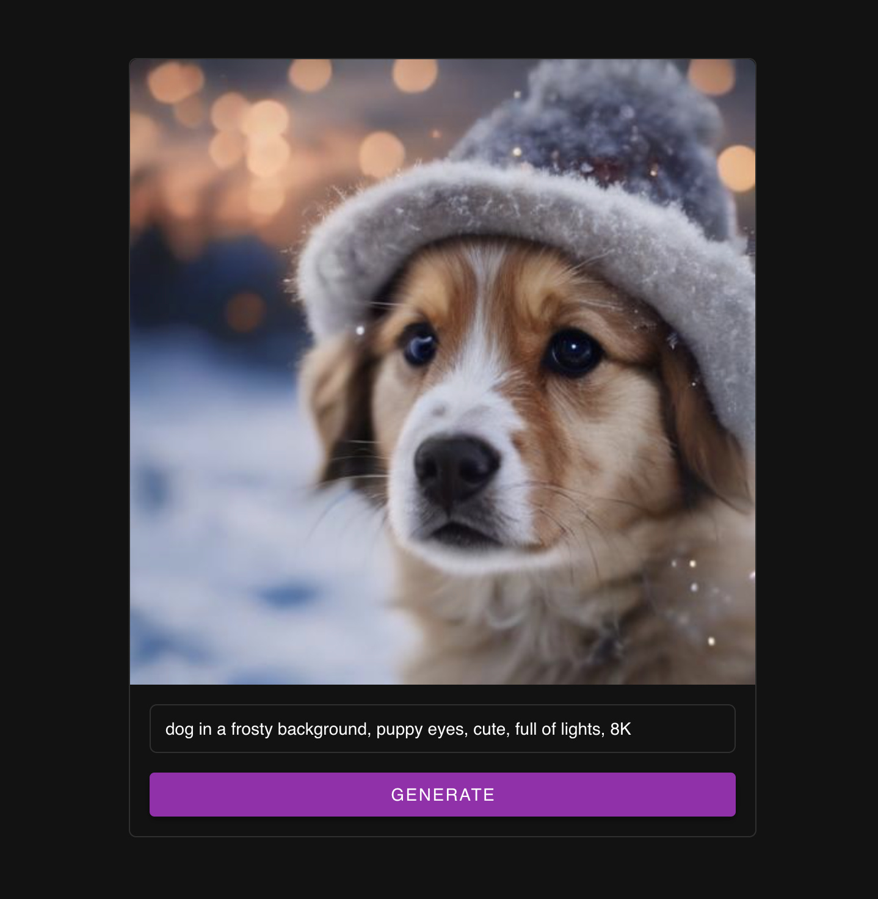

# FastServe

Machine Learning Serving focused on GenAI & LLMs with simplicity as the top priority.

> [](https://www.youtube.com/watch?v=GfcmyfPB9qY)
>
> YouTube: How to serve your own GPT like LLM in 1 minute with FastServe

## Installation

```shell
pip install git+https://github.com/aniketmaurya/fastserve.git@main
```

## Run locally

```bash
python -m fastserve
```

## Usage/Examples

### Serve Mistral-7B with Llama-cpp

```python
from fastserve.models import ServeLlamaCpp

model_path = "openhermes-2-mistral-7b.Q5_K_M.gguf"
serve = ServeLlamaCpp(model_path=model_path, )
serve.run_server()
```

or, run `python -m fastserve.models --model llama-cpp --model_path openhermes-2-mistral-7b.Q5_K_M.gguf` from terminal.

### Serve SDXL Turbo

```python
from fastserve.models import ServeSDXLTurbo

serve = ServeSDXLTurbo(device="cuda", batch_size=2, timeout=1)
serve.run_server()
```

or, run `python -m fastserve.models --model sdxl-turbo --batch_size 2 --timeout 1` from terminal.

This application comes with an UI. You can access it at [http://localhost:8000/ui](http://localhost:8000/ui) .





### Face  Detection

```python
from fastserve.models import FaceDetection

serve = FaceDetection(batch_size=2, timeout=1)
serve.run_server()
```

or, run `python -m fastserve.models --model face-detection --batch_size 2 --timeout 1` from terminal.

### Image Classification

```python
from fastserve.models import ServeImageClassification

app = ServeImageClassification("resnet18", timeout=1, batch_size=4)
app.run_server()
```

or, run `python -m fastserve.models --model image-classification --model_name resnet18 --batch_size 4 --timeout 1` from
terminal.

### Serve Custom Model

To serve a custom model, you will have to implement `handle` method for `FastServe` that processes a batch of inputs and
returns the response as a list.

```python
from fastserve import FastServe


class MyModelServing(FastServe):
    def __init__(self):
        super().__init__(batch_size=2, timeout=0.1)
        self.model = create_model(...)

    def handle(self, batch: List[BaseRequest]) -> List[float]:
        inputs = [b.request for b in batch]
        response = self.model(inputs)
        return response


app = MyModelServing()
app.run_server()
```

You can run the above script in terminal, and it will launch a FastAPI server for your custom model.

## Deploy

### Lightning AI Studio ⚡️

```shell
python fastserve.deploy.lightning --filename main.py \
    --user LIGHTNING_USERNAME \
    --teamspace LIGHTNING_TEAMSPACE \
    --machine "CPU"  # T4, A10G or A10G_X_4
```

## Contribute

**Install in editable mode:**

```shell
git clone https://github.com/aniketmaurya/fastserve.git
cd fastserve
pip install -e .
```

**Create a new branch**

```shell
git checkout -b ＜new-branch＞
```

**Make your changes, commit and [create a PR](https://github.com/aniketmaurya/fastserve/compare).**


<!-- ## FAQ

#### Question 1

Answer 1

#### Question 2

Answer 2 -->
